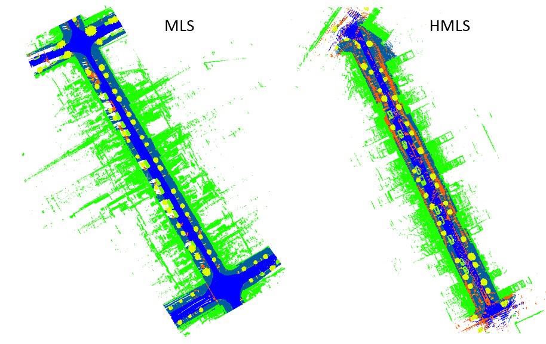

# SUD-Dataset
Silvia María González Collazo, Jesús Balado, Iván Garrido, Javier Grandío, Rabbia Rashdi, Elisavet Tsiranidou, Pablo del Río-Barral, Erik Rúa, Iván Puente and Henrique Lorenzo
## Introduction
The Santiago Urban Dataset (SUD) is a large labelled point cloud database acquired with MLS and HMLS scaners in Santiago de Compostela (Spain). Both data were georeferenced and labelled into eight main classes; *road, sidewalk, curb, buildings, vehicles, vegetation, pole-like elements* and *others*. Therefore, it is presented a datased which distinguish the ground urban elements and combines MLS with HMLS 3D point clouds.
This dataset covers around 2 km of streets, and contains fourteen segments of six urban streets.

Given the existence of two data sources, three tests with their corresponding three training sessions were performed: one considering only the MLS point clouds, another one considering only the HMLS point clouds and a third one considering both MLS and HMLS point clouds. The dataset was divided into training, validation and test sets. The following table shows the accuracies obtained for each training session.

## Point Cloud attributes
### MLS point clouds
- XYZ
- Number of Retuns
- Return number
- GPS Time
- Intensity
- Classification

### HMLS point clouds
- XYZ
- Classification

## Classes
- Road (label 0)
- Sidewlak (label 1)
- Curb (label 2)
- Building (label 3)
- Vehicles (label 4)
- Vegetation (label 5)
- Poles (Sings, Traffic lights and Street lights) (label 6)
- Others (label 7)

## Download
Dataset can be download at [OneDrive](https://universidadevigo-my.sharepoint.com/:f:/g/personal/silvgonzalez_uvigo_gal/Em0OZC-FmxtBgrXdZgxGrewBdVgkexzcJ-SDFIYJSMRK5A?e=mZMWnZ)
## Citation

## Avknowledgements
